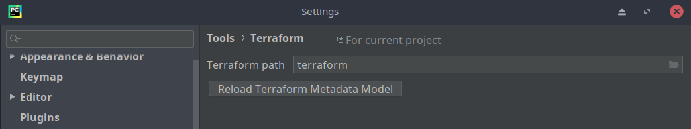
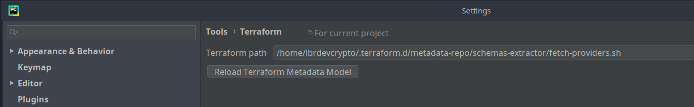

# Terraform metadata for PyCharm IDE

Este é um guia para ajudar a configurar a PyCharm IDE com plugin `HCL 'Hashicorp Configuration Language'` .

Quando instalamos o PyCharm IDE no ambiente Linux, temos a opção de instalar também o plugin HCL, para que sejamos capaz de programar Terraform pelo PyCharm .

Logo depois de instalar o plugin HCL temos realizar uma configuração em Settings -> Tools -> Terraform -> Terraform path, para que sejamos capazes de poder utilizar o Terraform pela propría IDE .

### Terraform path


No entanto temos um pequeno problema, quando vamos realizar a busca do binário Terraform dentro do nosso sistema operacional Linux, o PyCharm não consegue reconhecer o binário Terraform. O mesmo
cenário no ambiente Windows já é diferente, porque podemos encontrar o terraform.exe facilmente e realizar a configuração corretamente sem muita dor de cabeça. Depois de passar algumas horas 
tentando resolver esse problema sem sucesso, resolvi começar a buscar sobre o mesmo para ver como podia resolver esse problema definitivamente e poder usar PyCharm junto com Terraform no ambiente Linux .

Depois de realizar algumas buscas e ler sobre o assunto em alguns foruns encontrei uma solução relacionada. Metadata for HashiCorp Terraform é um repositório que contém alguns metadados para a 
ferramenta HashiCorp Terraform. Com essa tool adicional é possivel fazer o PyCharm funcionar correctamente com o plugin HCL. Esses metadados são usados ​​para o [IntelliJ-Terraform plugin](https://plugins.jetbrains.com/plugin/7808) .

### Uso

Para utilizar a ferramenta, acessamos o repositório [terraform-metadata](https://github.com/VladRassokhin/terraform-metadata) mantido pelo usuário [VladRassokhin](https://github.com/VladRassokhin) .

Executamos os seguintes comandos.

```
mkdir -p "$HOME/.terraform.d/metadata-repo"

git clone "https://github.com/VladRassokhin/terraform-metadata" "$HOME/.terraform.d/metadata-repo"
```

Para manter sempre atualizado realize um `git pull`

### Configurando terraform-metadata PyCharm

Depois de realizar um `git clone` devemos configurar o terraform path da seguinte maneira.



Feito isso o PyCharm é capaz de executar alguns comandos Terraform.

 * terraform fmt
 * terraform plan
 * terraform apply


 