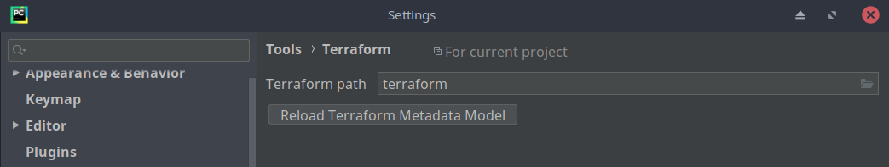

# Terraform metadata for PyCharm IDE

Este é um guia para ajudar a configurar a PyCharm IDE com plugin HCL.

Quando instalamos o PyCharm IDE no ambiente Linux, temos a opção de instalar também o plugin HCL 'Hashicorp Configuration Language' para que sejamos capaz de programar Terraform pelo PyCharm.

Logo depois de instalar o plugin HCL temos realizar uma configuração em Settings -> Tools -> Terraform -> Terraform path, para que sejamos capazes de poder utilizar o Terraform pela propría IDE.

# Terraform path

No entanto temos um pequeno problema, quando vamos realizar a busca o binário Terraform dentro do nosso sistema operacional, o PyCharm não consegue reconhecer o binário Terraform